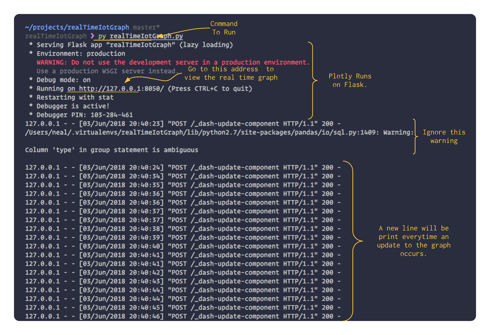
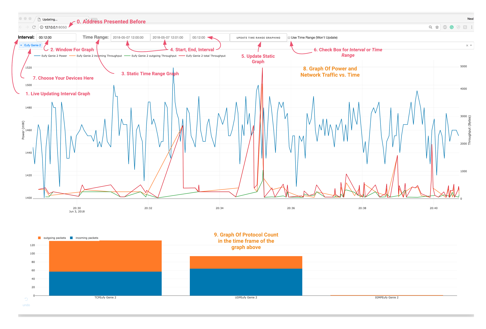

# Real Time IOT Graph
Graphs IOT device power and netowrk usage in real time with Plotly API.

# Installation
## 0. Dependencies
1. pip
2. python 2.7
## 1. Clone Repository and Download Python Packages
```
cd whatever/directory/you/want
git clone https://github.com/nealhnguyen/realTimeIotGraph.git
cd realTimeIoTGraph
pip install -r requirements.txt
```
## You're good to go!

# Running The Real Time Grapher
## 1. Create a login file named `loginCredentials` at the root of the repository
```
vim loginCredentials
```
## 2. Fill the file with login credentials
***In loginCredentials*** put in the host, user, password, and database. Make sure that:
* they are each on the own line
* they have no modifiers such as " , ; ' etc.
```
host
user
password
database
```
An example below
```
databasename.asdlfkjoue3.ca-south-4.rds.amazonaws.com
john
supersecurepassword
ip_log
```

## 3. Running The RealTimeIoTGraph
Simply call
```
py realTimeIoTGraph.py
```
Then click on the link provided to open the graph in your browser.

Running it should look like this.


### Now, the realTimeIoTGraph should be running in your browser.

## 4. Using The RealTimeIoTGraph
Once you run it, this is what you should see


0. The address you used before.

1. Interval is dark when you are in live graph mode.

   2. The field next to interval has the format HH:MM:SS. This specifies the window of time displayed in the live graph

3. Time Range is the static graph. It will be grey in live graphing mode and dark in static mode. You specify any time range in the past that contains logged data, and it will display that time frame in the graph. It will not live update.

   4. The text boxes next to the time range consists of the start time, end time, and interval. You only need to specify 2 of the 3 fields. If you specify all 3, then the program will use the start time and interval to calculate the end time.

   5. This button updates the static graph after you fill in the text boxes.

6. This check box toggles between interval (live graph) and Time Range (static graph) mode.